# Linux Server Administration, Monitoring & Troubleshooting on AWS

## Introduction

This project demonstrates the practical implementation of **Linux Server Administration, Monitoring, and Troubleshooting on AWS** using an Amazon EC2 instance. The project covers essential Linux administration tasks such as server and OS information checking, user and group management, file and directory management, permissions and ownership, package management, Nginx installation and configuration, website deployment, server monitoring, and basic troubleshooting.

The main objective of this project is to gain hands-on experience in managing and maintaining a Linux server in an AWS cloud environment and to understand common administration and troubleshooting tasks performed by a Linux System Administrator.

## Architecture Diagram

The architecture represents a Linux Server Administration, Monitoring & Troubleshooting environment on AWS. The project starts with an Amazon EC2 instance named “Linux Admin Server” running Amazon Linux. The server is accessed through SSH, where different Linux administration tasks such as server information checking, user and group management, file and directory management, permissions, and package management are performed.

After the basic administration tasks, Nginx is installed and configured as the web server. The Nginx service is started, enabled, and its configuration is tested before deploying a simple HTML website. The deployed website is then accessed through the EC2 instance's Public IP address from a web browser.

The server is also monitored using Linux commands such as ps aux, free -h, df -h, du -sh /var/log, and uptime to check processes, memory, disk usage, directory size, and system load. Finally, an Nginx service issue was encountered and resolved by checking the service status, starting and enabling Nginx, and verifying that the service was running successfully.

## Implementation Steps

### 1. EC2 Instance Launch & Server Connection

Launched an Amazon EC2 instance named **Linux Admin Server** with Amazon Linux.
Connected to the server using SSH to perform Linux administration tasks.

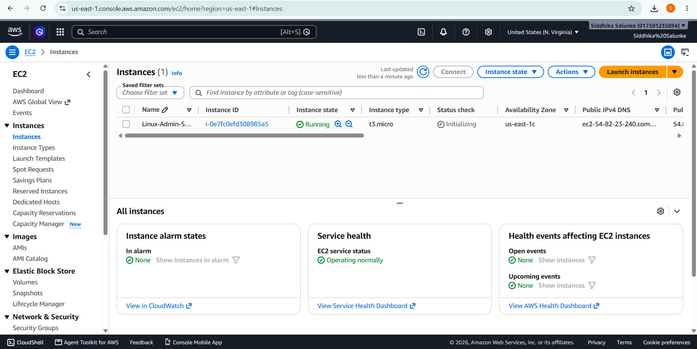

### 2. Basic System Commands

Executed basic Linux commands such as `whoami`, `hostname`, and `uname -a`.
These commands were used to identify the current user, server hostname, and system details.

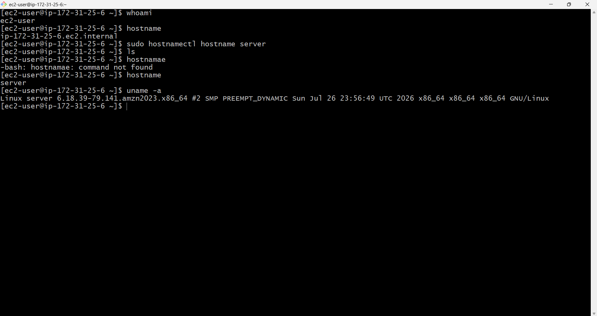

### 3. Server Information & OS Check

Checked the server and operating system information to understand the Linux environment.
Verified important system details required for server administration.

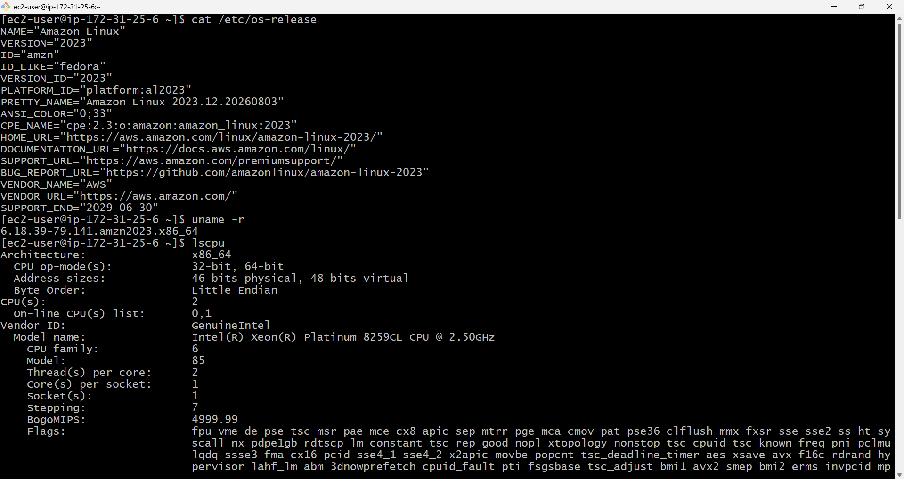

### 4. User and Group Management

Checked the currently logged-in user and examined existing users and groups on the Linux server using standard Linux commands.

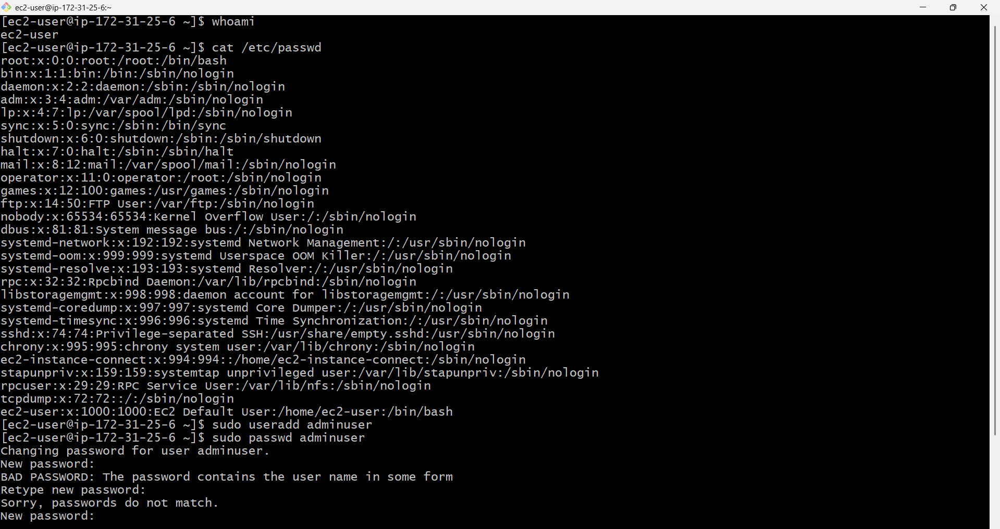
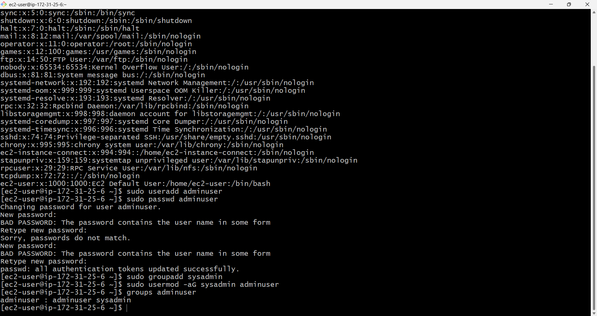

### 5. File and Directory Management

Created, viewed, copied, moved, and managed files and directories.
This step demonstrated basic file system administration on the Linux server.

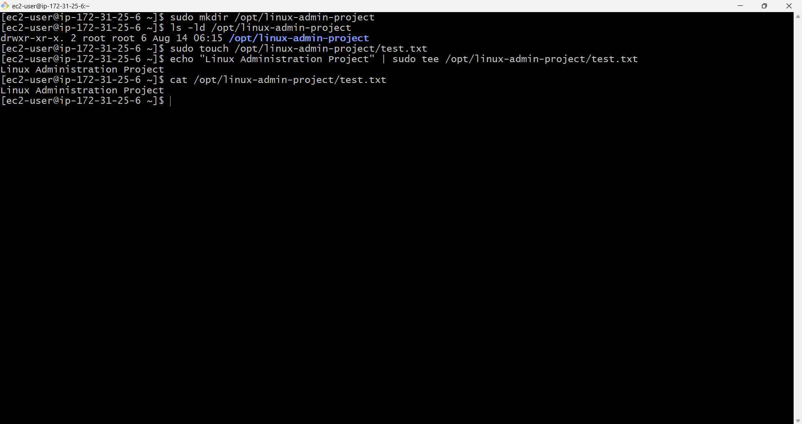

### 6. Permission and Ownership Management

Checked existing file permissions and modified them using appropriate commands.
Changed file ownership and verified the updated permissions and ownership.

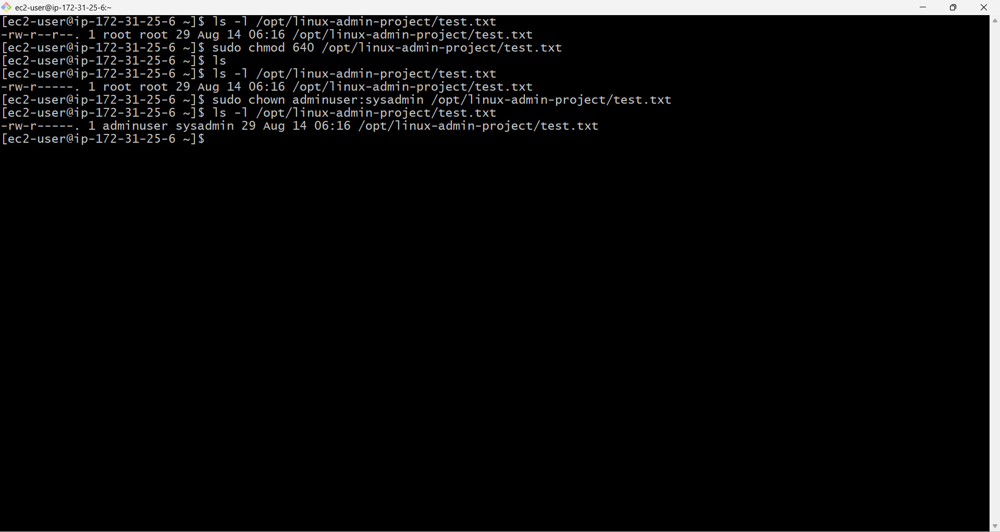

### 7. Package Management

Updated the system packages using `sudo dnf update -y`.
Installed and verified the Nginx web server using the DNF package manager.

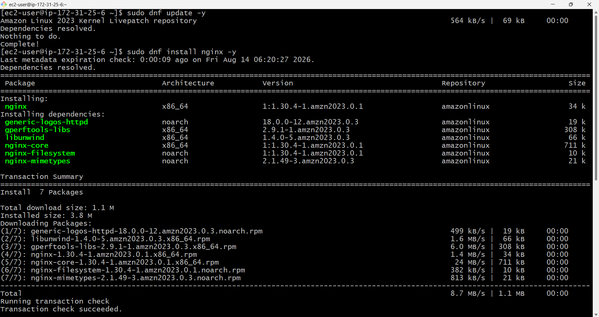
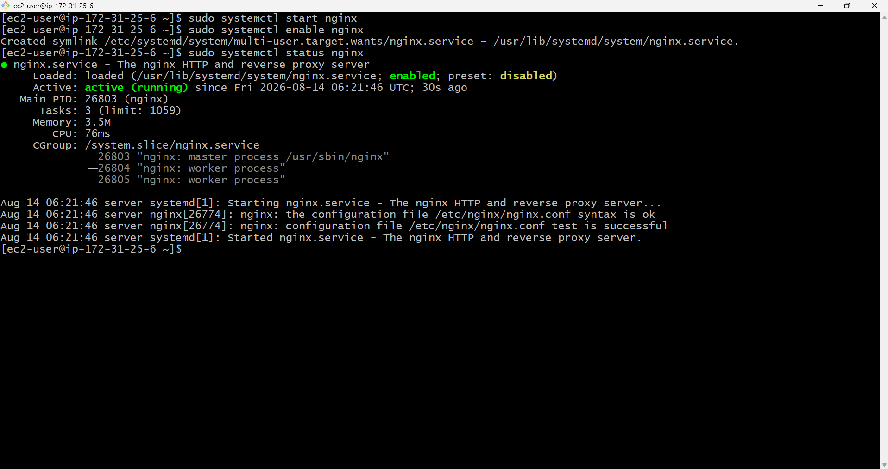

### 8. Nginx Configuration & Website Deployment

Configured Nginx, tested the configuration using `sudo nginx -t`, and managed the service.
Created and deployed a simple HTML website in the Nginx document root directory.

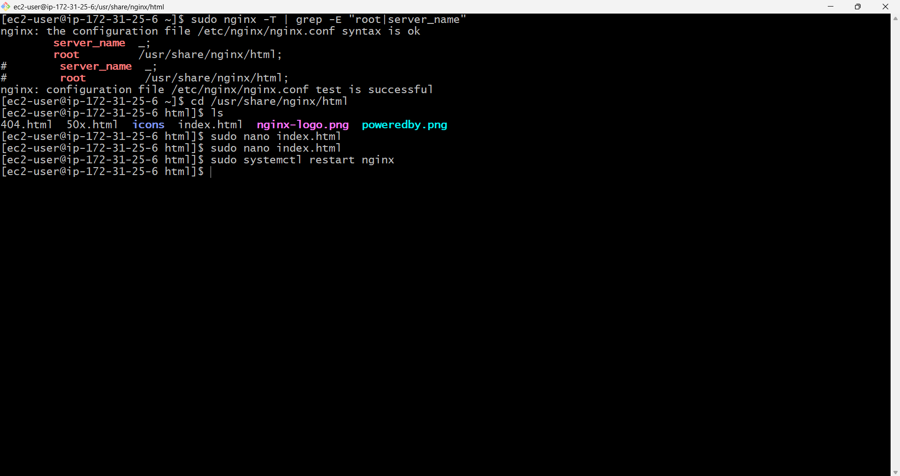

### 9. Website Testing

Copied the EC2 instance Public IP address from the AWS Console.
Accessed the website through a web browser and verified that the server was running successfully.

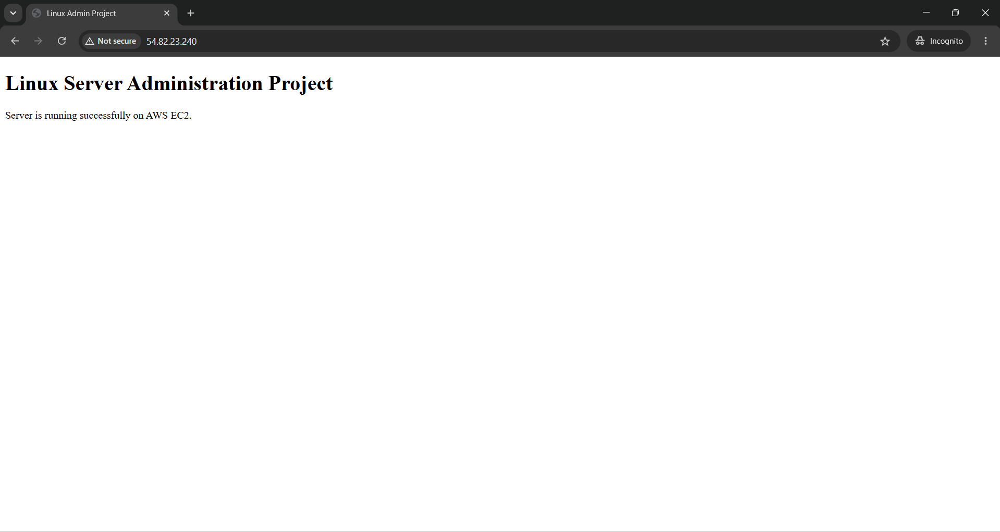

### 10. Server Monitoring

Monitored running processes, memory usage, disk usage, directory size, and server load.
Commands such as `ps aux`, `free -h`, `df -h`, `du -sh /var/log`, and `uptime` were used.

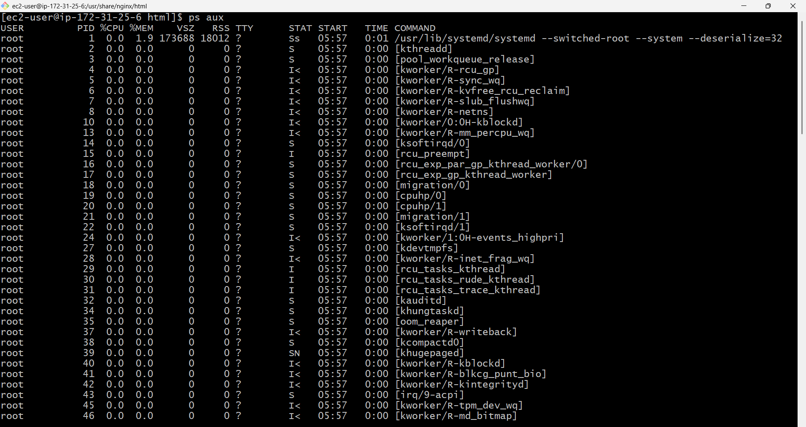
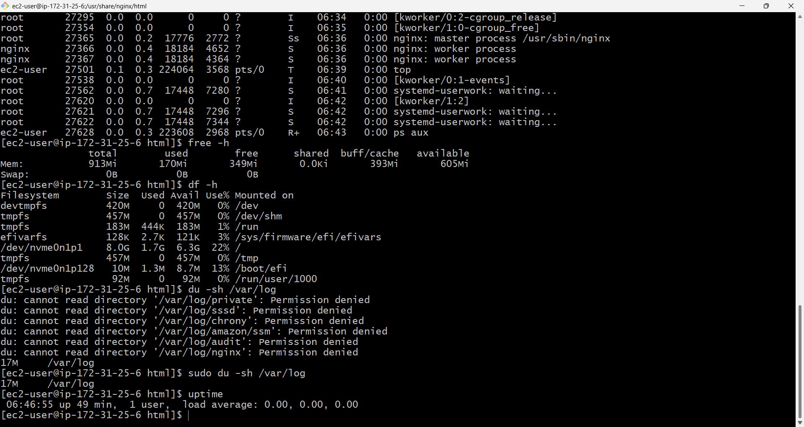

### 11. Nginx Troubleshooting

Detected that the Nginx service had stopped and checked its status using `systemctl`.
Started and enabled the service, then verified that Nginx was running successfully.

## Project Summary

This project provided hands-on experience in **Linux Server Administration, Monitoring, and Troubleshooting on AWS**. An Amazon EC2 instance running Linux was launched and configured to perform essential system administration tasks, including server and OS information checking, user and group management, file and directory management, permissions and ownership management, and package management.

Nginx was installed and configured as a web server, and a simple website was deployed and successfully accessed using the EC2 instance's Public IP address. The server was also monitored using Linux commands to check running processes, memory utilization, disk usage, directory size, and system load.

During the project, an issue was encountered where the Nginx service had stopped. The issue was identified by checking the service status and resolved by starting and enabling the Nginx service. This project helped develop practical skills in managing, monitoring, maintaining, and troubleshooting a Linux server in an AWS cloud environment.

